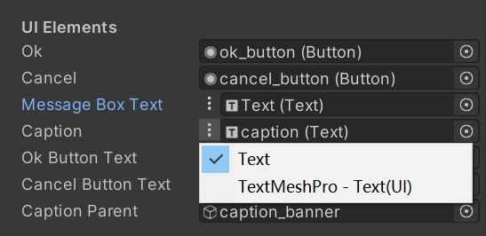

# Generic UI Text Reference

A simple tool to create a SerializeField to reference UnityEngin.UI.Text and TMPro.TextMeshProUGUI at the same time.
[(中文)](README_ZH.md)
## Usage

```csharp
    [SerializeField]
    SKUnityToolkit.GenericUITextReference.TextReference m_Caption;

    void Start()
    {
        m_Caption.text = "Caption";
    }
```


