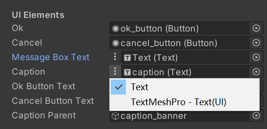

# Generic UI Text Reference

UnityEngin.UI.Text和TMPro.TextMeshProUGUI的融合类型，自定义的编辑器检视面板，提供类型和对应资产的选择。

## Usage

```csharp
    [SerializeField]
    SKUnityToolkit.GenericUITextReference.TextReference m_Caption;

    void Start()
    {
        m_Caption.text = "Caption";
    }
```


